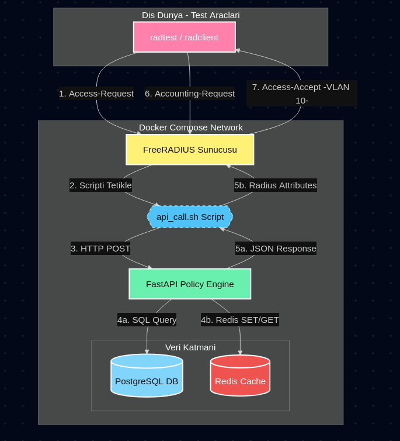

# 🛡️ Dinamik NAC (Network Access Control) Sistemi

Bu proje, ağ güvenliğini otomatize eden; **FreeRADIUS**, **FastAPI**, **PostgreSQL** ve **Redis** bileşenlerini Docker üzerinde birleştiren modern bir erişim kontrol sistemidir.

## 📌 Proje Hakkında
Geleneksel ağ yönetimini modern web teknolojileriyle birleştirerek; kullanıcıların ağa giriş anından çıkış anına kadar olan tüm süreçlerini (AAA) otomatik bir yapıya kavuşturur.

---

## 🏗️ Sistem Mimarisi ve Akış
Aşağıdaki şema, bir kullanıcının sisteme bağlanma isteği gönderdiğinde arka planda çalışan tüm süreçleri göstermektedir:



### **Akış Adımları:**
1. **İstek (Access-Request):** Kullanıcı bilgileri FreeRADIUS'a gelir.
2. **Haberleşme (Exec/CURL):** FreeRADIUS, bir script aracılığıyla FastAPI'ye "Bu kullanıcı girebilir mi?" diye sorar.
3. **Karar (Policy Engine):** FastAPI; PostgreSQL'den kullanıcıyı doğrular ve Redis'e "Aktif Oturum" kaydı açar.
4. **Cevap (VLAN Steering):** Onay gelirse kullanıcıya özel **VLAN 10** etiketi basılarak ağa kabul edilir.

---

## 🛠️ Teknik Bileşenler

| Bileşen | Görevi |
| :--- | :--- |
| **FreeRADIUS** | Ana ağ sunucusu; paketleri karşılar ve yetki verir. |
| **FastAPI** | Sistemin beynidir; tüm mantıksal kararları verir. |
| **PostgreSQL** | Kalıcı arşiv; kullanıcı bilgilerini ve logları saklar. |
| **Redis** | Yüksek performanslı cache; anlık bağlı kullanıcıları takip eder. |
| **Docker** | Tüm sistemi "tak-çalıştır" hale getirir. |

---

## 🚀 Hızlı Kurulum

Sistemi tek bir komutla ayağa kaldırabilirsiniz:

```bash
# Projeyi klonlayın
git clone <sizin-repo-linkiniz>

# Docker ile başlatın
docker-compose up --build
